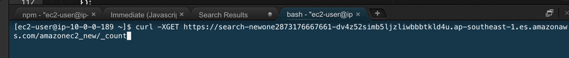
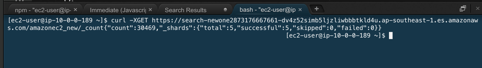

## [Ask Jeeves](https://en.wikipedia.org/wiki/Jeeves): Backend integration of mobile applications using AWS AppSync

<!DOCTYPE html>
<html>
<head>
<meta name="viewport" content="width=device-width, initial-scale=1">

</head>
<body>

In this example, we use JavaScript to "click" on the London button, to open the tab on page load.

  <button class="tablinks" onclick="openCity(event, 'London')" id="defaultOpen">London</button>
  <button class="tablinks" onclick="openCity(event, 'Paris')">Paris</button>
  <button class="tablinks" onclick="openCity(event, 'Tokyo')">Tokyo</button>

  <h3>London</h3>
  
London is the capital city of England.

  <h3>Paris</h3>
  
Paris is the capital of France.
 

  <h3>Tokyo</h3>
  
Tokyo is the capital of Japan.

     
</body>
</html> 
     

##  Getting Started

1.	Login to AWS console and make sure to select Singapore (`ap-southeast-1`) region. You need to be in **Singapore** region for this lab. 
2.	Go to EC2 page and create a new key pair if not already exists and download the key to your machine.
3.	Open AWS Cloud9 services page.
4. Click on **Create Environment**.
  

5. Give any appropriate name and description to your environment. Click on **Next**.
6. In the next page, select the option **Connect and run in remote server (SSH)**. Scroll down and expand View Public SSH key. Click **Copy key to clip board**. Once you have copied the key, please leave this screen intact. We will come back once the EC2 creation completed. 

7. Open a new browser tab and instantiate this CloudFormation template: 

8. Click on **Next**. 

9. Please provide below inputs
	* Stack Name :  cloud9env (any name as you prefer)
	* Cloud9Key : Paste the key you have copied in the step 6
	* InstanceType : You can leave the default (c4.xlarge)
	* KeyName : Please select the existing key in this region(Singapore). If not, please create one 
	* SSHLocation : We can leave as the default value.
	
	Click on **Next**.
10. Leave the defaults as-is on this screen, click **Next**.
11. In Next screen, Select the checkbox for “I acknowledge that cloudformation might create IAM resouces” in the bottom and Click **Create**.
12. Once the stack creation completes, Go to Outputs and copy the IP address as below 

13. Go to the cloud9 screen/tab when we left in the step 6 and fill the below details and then click Next step
	* User : ec2-user
	* Host : Paste the IP address copied from the cloudformation stack in step 12
	* Port : 22
	* Advanced settings. Environment path – give any pathname (without spaces)
	
14. Click **Create environment**.
    
15. In the below screen, uncheck the “c9.ide.lambda.docker”. Click **Next**.
    
16. In the next screen, click cancel the installation and click Finish. We do not need lambda related stuffs for now
    
17. Click **Finish** in the below screen
	
16. Your cloud9 environment is ready
    

## Configure Expo
**Install Expo mobile client**

Follow the installation instructions for your mobile device on the [official Expo website](https://docs.expo.io/versions/latest/introduction/installation#mobile-client-expo-for-ios-and-android)

**Create Expo account**

Create an Expo account via the [offical Expo website](https://expo.io/signup)

Now you have successfully setup Expo and your AWS Cloud9. 

## Customizing the Cloud9 Environment

1. Go to the newly cloud9 environment and click the settings, select THEMES(top right corner near cloud9 symbol). Select one of the Classic theme and night based color ( this is needed for the QR code to be visible for the expo client).

2. Once the theme got changed, open terminal window. The current working directory will be whatever the environment name you have given during the cloud9 create environment steps.
3. One a shell/terminal and run command `create-react-native-app Test`.

4. Once the creation is success, you will see the final confirmation as below. Also, in your cloud9 IDE, you will see the project folder “Test”.

5. `cd Test; npm start`

6. Now, from your mobile, open the expo app.
7. Scan the QR code on the expo app and you will see the application loading in your mobile.
8. You can edit the file `App.js` and once saved, you will see the application in your mobile auto load the changes.

## Verifying your Elasticsearch cluster installation

1.	Open the cloud9 terminal
2.	Issue the below command `curl -XGET <your es domain name – copy from cloudformation output>/amazonec2_new/_count`

